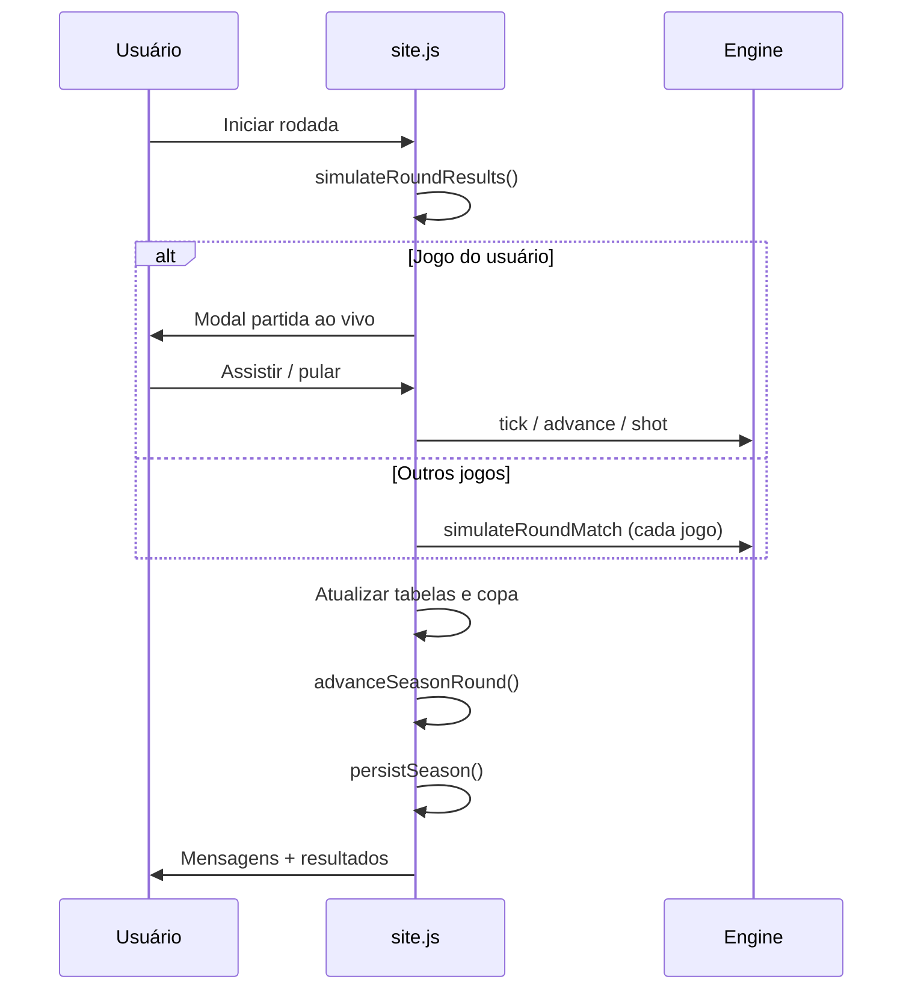

# 04 — Rotinas e Fluxos

## Rotinas de boot

| Rotina | Quando | Ação |
|--------|--------|------|
| `hydrateSaves` | Load | Lê localStorage |
| Career gate | Sem save | Modal nova carreira / redirect |
| World gen | Nova carreira | Gera clubes, fixtures, copa |
| `renderCurrentView` | Após boot / nav | Renderiza view ativa |

---

## Rotina: Nova carreira

1. Usuário abre `index.html?novo=1` ou clica Novo Jogo em `home.html`
2. Modal coleta: técnico, clube, divisão, formação
3. `#confirmNewGame` → gera universo
4. `persistCareer()` + `persistSeason()`
5. `redirectGame()` — remove `?novo=1`
6. Render dashboard

**Cancelar:** se veio de `?novo=1` sem save → `home.html`

---

## Rotina: Navegação entre views

```
.nav-btn[data-view] → click
  → activeView = view
  → renderCurrentView()
    → renderDashboard | renderSquad | renderTactics | ...
```

---

## Rotina: Rodada de campeonato



---

## Rotina: Partida ao vivo

1. Abre modal com estado `liveMatch`
2. `setInterval` ou `requestAnimationFrame` chama `tick`
3. Cada tick: `advance` → eventos → atualiza DOM
4. `bindLiveActions()` reanexa botões
5. Fim: `finalizeLiveMatch` → stats → `pushMessage`

**Controles:** velocidade, pular para fim, substituições (se disponível).

---

## Rotina: Fim de temporada

1. Última rodada detectada em `advanceSeasonRound`
2. `prepareSeasonTransition` calcula movimentações
3. Modal resumo exibido
4. Usuário clica **Próxima temporada**
5. `#startNextSeason` → reset parcial, novo calendário
6. `finalizeNationalRankingSeason`
7. `redirectGame()` + persist

---

## Rotina: Copa do Brasil

1. Fixtures gerados por fase
2. A cada rodada relevante: `simulateCupFixtures` (ou integrado na rodada)
3. Vencedores avançam; agregado em jogos de ida/volta
4. `currentPhase` incrementa até FINAL
5. Campeão em `cupCompetition.champion`

---

## Rotina: Treino

- Configurado em `matchday-training-rules`
- Dias livres / pré-jogo / pós-jogo
- Pode alterar `workload` e disparar `resolvePhysicalIncident`

---

## Rotina: Tratamento médico

1. Jogador lesionado aparece em elenco
2. Modal tratamento → escolha de programa
3. Atualiza `injury.daysLeft` ou flags de retorno
4. `pushMessage` categoria `medical`

---

## Handlers padronizados

```javascript
// Elementos estáveis
onClick(element, handler)
on(element, 'input', handler)

// Formações (delegação)
onClick(grid, e => {
  const btn = e.target.closest('button')
  if (btn) applyFormationChoice(btn.dataset.formation)
})

// Pós-ação sem query string
redirectGame()  // location.replace(pathname)
```

**Exceção:** `bindLiveActions` usa `.onclick` em botões recriados.

---

## Rotina: Opções / ritmo

- Modal opções altera `futmanager-pace`
- Afeta `gamePaceConfig` no próximo jogo ao vivo

---

## Documentação relacionada

- [Interface](./06-INTERFACE.md)
- [Modelos de dados](./05-MODELOS-DADOS.md)
