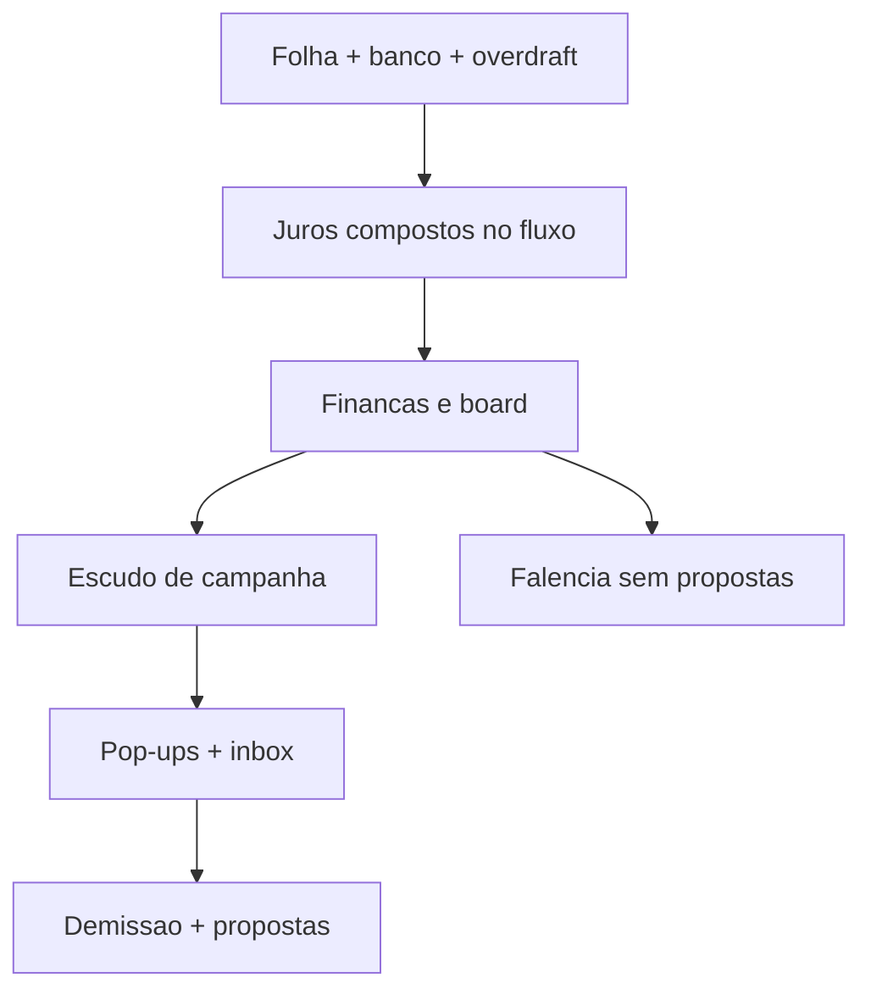

# Matchday Football — Risco e “quebra” financeira

**Escopo:** empréstimo bancário + folha + saúde financeira + demissão + **falência formal**.  
**Status:** calibração **v6** — demissão v2 (Projeto Protegido + Crise Real) + pop-ups de aviso.

---

## Veredito

Existem **dois fins de ciclo**:

| Fim | O que acontece |
|-----|----------------|
| **Demissão** | Crise institucional → modal + propostas de emprego ou encerrar |
| **Quebra / falência** | Insolvência objetiva → **sem propostas**, save limpo → home |

O caixa pode ficar negativo (overdraft). Juros de cheque e atraso de empréstimo são **compostos no fluxo da rodada nacional**.



---

## Alertas ao jogador (pop-ups)

| Evento | Modal | Inbox |
|--------|-------|-------|
| Insolvência (2º atraso, OD, rombo) | `clubInsolvencyWarnModal` | Não |
| Restrição de mercado | `clubFinancialRestrictionModal` | Não |
| Risco de demissão | `managerJobWarnModal` | Sim |
| Demissão | `managerSackModal` | Sim |
| Falência | `clubBankruptcyModal` | Sim |

Arquivos: [`js/feature/club-insolvency-warn`](../js/feature/club-insolvency-warn/index.js), [`js/feature/manager-job-warn`](../js/feature/manager-job-warn/index.js), [`js/feature/manager-sack`](../js/feature/manager-sack/index.js), [`js/feature/club-bankruptcy`](../js/feature/club-bankruptcy/index.js).

---

## Quebra formal (`resolveClubBankruptcyRisk`)

Arquivo: [`js/engine/club-solvency.js`](../js/engine/club-solvency.js)

1. 1º atraso → taxa efetiva **reaplicada 3×** no saldo + multa.  
2. Cada atraso seguinte reaplica mais vezes (4× / 5× / 6×).  
3. **2º atraso** → **modal em tela** (one-shot).  
4. Regularizar → compostos renegociados + janela de reabilitação.  
5. Falência após ~4–5r no cheque especial (atraso ≥ 3 + caixa vermelho 5r, rombo ≥ 4× custo/rodada, ou OD streak ≥ 5 + finanças no piso).

Prioridade: se sack e bankrupt na mesma rodada → **bankrupt**.

---

## Demissão v2 (`resolveBoardJobRisk`)

Arquivo: [`js/engine/manager-job.js`](../js/engine/manager-job.js)

### Limiares

| Limiar | Valor | Uso |
|--------|-------|-----|
| Colapso duplo | **≤ 28%** | Diretoria **e** finanças no piso → demissão imediata |
| Crise | **< 40%** | Avisos, streak de diretoria, zona quente |
| Severo | **≤ 32%** | Par crítico |
| Zona quente | **< 45%** | Par sustentado (3 rodadas) |

### Gatilhos de demissão

1. **Colapso duplo** — ambos ≤ 28% (escudo **não** protege)  
2. **Par crítico** — um ≤ 32 + outro < 40  
3. **Zona quente** — um < 40 + outro < 45 por **3 rodadas**  
4. **Board streak** — diretoria < 40 por **8 rodadas**

### Escudo de campanha (`resolveCampaignShield`)

| Nível | Condição | Efeito |
|-------|----------|--------|
| **Fortaleza** | Meta ≥ 80% **ou** posição dentro da meta | Bloqueia par crítico, zona quente e board streak |
| **Amortecedor** | Meta ≥ 55% **ou** status near/met/exceeded | 1 rodada de graça no par crítico |
| **Nenhum** | Abaixo disso | Regras completas |

Pressão financeira sobre a diretoria é reduzida com campanha boa (35% / 65% / 100%) — [`js/engine/club-status/rules/board.js`](../js/engine/club-status/rules/board.js).

### Recuperação

Com diretoria **e** finanças ≥ 45%, flags de aviso e streaks são **zerados** no save.

---

## Motor econômico (v5)

| Peça | Valor |
|------|-------|
| Orçamento inicial A/B/C/D | 9,5 / 6,2 / 4,2 / 2,7 mi |
| Taxa empréstimo A–D | 1,3% / 1,5% / 1,7% / 1,9% por rodada |
| Amort mínima | **5,5%** do principal |
| Multa atraso | 28% (capitaliza) |
| Compostos (apps) | 3× / 4× / 5× / 6× por streak de atraso |

---

## Sims

```bash
node scripts/manager-job-sim.mjs
node scripts/finances-impact-tests.mjs
node scripts/club-solvency-tests.mjs
node scripts/bank-loan-tests.mjs
node scripts/v4-risk-matrix-sim.mjs
node scripts/overdraft-streak-sim.mjs
```

Alvo: campanha boa + finanças ~31% → **aviso**, não demissão surpresa; colapso 28/28 → demissão; ignorar Escritório → quebra ou demissão após avisos visíveis.
