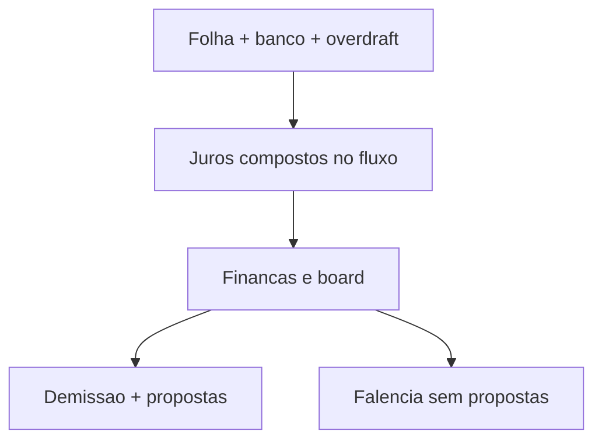

# Matchday Football — Risco e “quebra” financeira

**Escopo:** empréstimo bancário + folha + saúde financeira + demissão + **falência formal**.  
**Status:** calibração **v5** — quebra do clube existe e encerra a carreira.

---

## Veredito

Existem **dois fins de ciclo**:

| Fim | O que acontece |
|-----|----------------|
| **Demissão** | Diretoria + finanças em crise → propostas de emprego ou encerrar |
| **Quebra / falência** | Insolvência objetiva → **sem propostas**, save limpo → home |

O caixa pode ficar negativo (overdraft). Juros de cheque e atraso de empréstimo são **compostos no fluxo da rodada nacional** (debitam caixa e/ou incham dívida).



---

## Quebra formal (`resolveClubBankruptcyRisk`)

Arquivo: [`js/engine/club-solvency.js`](../js/engine/club-solvency.js)

**Modelo fluido (compostos no atraso):**

1. 1º atraso → taxa efetiva **reaplicada 3×** no saldo + multa; caixa sofre cobrança emergencial (não quita a dívida).  
2. Cada atraso seguinte reaplica mais vezes (4× / 5× / 6×) → dívida **salta**; o espiral não deve se arrastar dezenas de rodadas.  
3. **2º atraso** → **modal em tela** (one-shot; fechar descarta — **não** vai para a inbox).  
4. **Regularizar (voltar a pagar em dia):** compostos são renegociados (saldo volta ao principal) + janela de reabilitação (sem juro/parcela) — quem fica no azul e paga consegue escapar da quebra.  
5. Falência **não** é na 1ª rodada no vermelho. Quebra quando a dívida fica insustentável após ~4–5r no cheque especial:
   - atraso ≥ 3 **e** caixa vermelho por **5 rodadas** seguidas, ou  
   - rombo ≥ 4× custo/rodada com as mesmas 5r no vermelho, ou  
   - overdraft streak ≥ 5 e finanças no piso.

UI aviso: [`js/feature/club-insolvency-warn/index.js`](../js/feature/club-insolvency-warn/index.js).  
UI falência: [`js/feature/club-bankruptcy/index.js`](../js/feature/club-bankruptcy/index.js) — modal sem ofertas.  
Resgate no Escritório: pagar mínimo do empréstimo, vender elenco, **adiantar direitos de TV** (deságio 20–28%, 1×/temporada, só sob crise).  
Prioridade: se sack e bankrupt na mesma rodada → **bankrupt**.

---

## Motor econômico (v5)

| Peça | Valor |
|------|-------|
| Orçamento inicial A/B/C/D | 9,5 / 6,2 / 4,2 / 2,7 mi |
| Taxa empréstimo A–D | 1,3% / 1,5% / 1,7% / 1,9% por rodada |
| Amort mínima | **5,5%** do principal (Escritório) |
| Multa atraso | 28% (capitaliza) |
| Compostos (apps) | 3× / 4× / 5× / 6× por streak de atraso |
| Forçada | desde a **1ª** rodada; agrava ×1,25 / ×1,5 / ×1,9 / ×2,4 |
| OD premium com loan | **2,4×** |
| OD streakMult | 1 → 1,25 → 1,55 → 1,8 |
| OD → dívida | streak ≥ 3: 50% do juro de OD capitaliza no empréstimo |

---

## Demissão (inalterada na lógica de emprego)

- Crise &lt; 40; severa &lt; 32; soft pair; board streak 8  
- Dinheiro sozinho não demite — precisa board/finanças  
- Ofertas em [`js/feature/manager-sack`](../js/feature/manager-sack/index.js)

---

## Sims

```bash
node scripts/club-solvency-tests.mjs
node scripts/bank-loan-tests.mjs
node scripts/v4-risk-matrix-sim.mjs
node scripts/overdraft-streak-sim.mjs
node scripts/economy-red-ink-diag.mjs
```

Alvo: gestão ok sem vermelho/quebra; **ignorar o Escritório ≥4 rodadas → quebra**; queima + ignora → vermelho r2 e quebra ~r5; overdraft estressado → demissão ou quebra.
