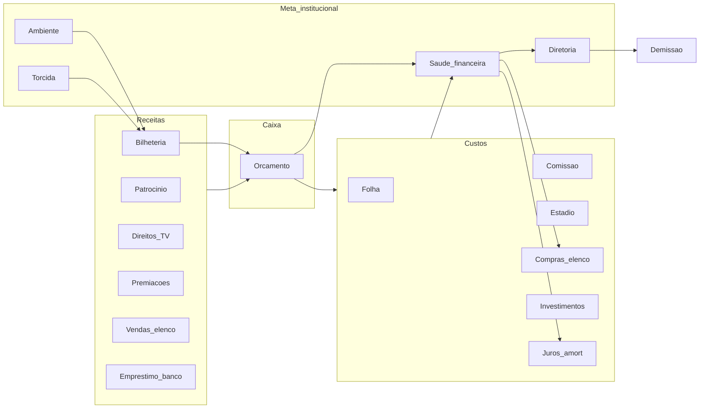

# Ecossistema econômico — descritivo

**Objetivo:** economia de clube que se comporta como um sistema fechado com feedbacks reais — arrecadação, folha, crédito, mercado e diretoria se empurram o tempo todo.  
**Relacionado:** [09-RISCO-QUEBRA-FINANCEIRA.md](./09-RISCO-QUEBRA-FINANCEIRA.md) (risco / demissão).

Este documento descreve a **visão do ecossistema** (como deve se sentir ao jogar) e ancora o que **já existe** no Alpha. Não é checklist de implementação.

---

## 1. Ideia central

O clube é uma empresa de futebol com **caixa**, **obrigações recorrentes** e **reputação de crédito**.

Dinheiro não é pontuação isolada. Cada real que entra ou sai altera:

- capacidade de pagar folha e estádio na próxima rodada;
- humor da diretoria e risco de demissão;
- linha e juros do banco;
- agressividade no mercado (comprar / vender / emprestar jogador);
- público e bilheteria (via Ambiente / Torcida e preço de ingresso).

Quem joga “rico sem lastro” sente juros, atrasos e pressão da mesa. Quem equilibra receita e folha sente crédito mais barato e mais folga tática.

---

## 2. As quatro pontas (e como se tocam)

### 2.1 Arrecadação (entrada)

| Fonte | Natureza | Influências práticas |
|-------|----------|----------------------|
| **Bilheteria** | Por jogo em casa | Preço × público × `GATE_REVENUE_SCALE` (v4 = 0,28); não deve sozinha cobrir a folha |
| **Patrocínio** | Parcela por rodada nacional | Pacote da temporada / divisão (v4, apertado vs v3); pressão do pacote na “qualidade” do acordo |
| **TV** | Parcela por mando de campo (nacional) | Pool da série ÷ mandos (A/B/C: 19, D: 11); v4 apertado; Copa não paga |
| **Adiantamento de TV** | Evento pontual (crise) | Botão no card TV / mando (Fluxo de caixa); deságio 20–28%; 1×/temporada; confirmação em janela (sem inbox) |
| **Premiações** | Pico no fim (e fases) | Tabela, título, acesso, copa — prêmio grande muda caixa e saúde de uma vez |
| **Vendas no mercado** | Evento de janela | Necessidade + humor do vendedor; dinheiro fresco, elenco mais fraco |
| **Empréstimo bancário** | Evento pontual | Antecipa caixa; cria obrigação recorrente (juros + amortização) |

**Leitura de jogo:** receita recorrente (patrocínio + TV + fatia de bilheteria) é o que o banco e o gate de folha usam como “renda mensal” do clube. Premiação, venda e adiantamento de TV são choques — bons para sanar, ruins se viram vício (o adiantamento come o futuro do caixa).

### 2.2 Salários e custos fixos (saída obrigatória)

| Custo | Natureza | Influências práticas |
|-------|----------|----------------------|
| **Folha de jogadores** | Toda rodada nacional | Elenco grande/caro aperta cobertura receita/folha; shortfall marca atraso |
| **Comissão técnica** | Toda rodada | Escala com reputação / contrato do técnico |
| **Operação do estádio** | Toda rodada | Capacidade, estrutura e gramado pesam no custo fixo |
| **Investimentos** | Voluntário | Médico, prevenção, gramado, arquibancada — melhoram jogo/longo prazo, tiram caixa agora |
| **Name rights** | Voluntário | Gasto de marca; não é receita de naming (ainda) |

**Leitura de jogo:** a pergunta certa não é “tenho caixa hoje?”, e sim “o caixa cobre **N rodadas** de custo + serviço do banco?”. Isso é a *runway*. Runway curta pressiona saúde financeira e diretoria mesmo sem demissão imediata.

### 2.3 Crédito bancário (alavanca com custo)

O banco não olha só a série. Olha **economia do clube**:

- receita recorrente estimada;
- custo da rodada (folha + comissão + estádio);
- cobertura (receita ÷ custo);
- caixa como colateral leve;
- saúde financeira;
- atrasos de folha ou de serviço do empréstimo.

**Efeitos práticos:**

- Saúde alta + cobertura boa → mais crédito, juros menores.  
- Folha pesada ou atraso → linha corta, juros sobem, ou crédito some (&lt; ~22% de saúde).  
- Um contrato por vez; **híbrido:** juros no caixa todo round; amortização mínima **5,5%** no Escritório.  
- Atraso no mínimo → taxa **reaplicada 3–6×** no saldo (compostos) + multa; cobrança emergencial sangra o caixa sem abater a dívida.  
- **2º atraso** → modal em tela (one-shot; não vai para a inbox).   
- Falência vem do espiral (dívida inchada → vermelho → rombo/OD), não de contagem fixa com caixa positivo.  
- Cheque especial: compostos; OD streak ≥ 3 + loan → metade do juro engorda a dívida.  
- A dívida **persiste** entre temporadas e reloads; só zera na quitação ou ao trocar de clube.

Ver simulação: `node scripts/bank-loan-risk-sim.mjs` e doc 09.

### 2.4 Mercado de transferências (elencos ↔ caixa)

| Movimento | Efeito em caixa | Travas práticas |
|-----------|-----------------|-----------------|
| Comprar | Saída grande | Caixa + gate de folha (`evaluateRosterPayroll`) + limites CBF |
| Vender | Entrada | Mínimo de elenco; humor (finanças/diretoria/ambiente) muda aceitação |
| Empréstimo de jogador | Menos rígido que compra | Limite de slots; opção de compra no fim |
| Já negociado na janela | — | Um movimento por jogador/janela |

**Feedback:** comprar demais → folha sobe → cobertura cai → banco aperta → saúde cai → diretoria pressiona → vender vira obrigação, não escolha.

---

## 3. Medidores institucionais (o “crédito social” do clube)

| Medidor | O que representa | Como a economia mexe |
|---------|------------------|----------------------|
| **Saúde financeira** | Solidez vista pelo banco e pela mesa | Caixa vs baseline da série, runway, dívida bancária (haircut), shortfalls |
| **Diretoria** | Emprego do técnico | Sofre com finanças baixas, runway curta, shortfall e streak de overdraft (~5–6 rodadas no vermelho = crise forte); não demite *só* por 1–2 rodadas no negativo |
| **Ambiente** | Clima interno / performance de campo | Resultados + pressão financeira (atraso/OD) por rodada |
| **Torcida** | Apoio e público | Bilheteria (lotação) + pressão financeira (atraso/OD); restrição de mercado piora um pouco |

**Fins de ciclo:** **demissão** (propostas) ou **falência formal** do clube (sem propostas, save limpo) — ver doc 09.

---

## 4. Ciclo de uma rodada nacional (ordem que importa)

1. Cobra **folha + comissão + estádio** (débito integral; caixa pode ir a negativo).  
2. Credita **parcela de patrocínio** (TV não entra aqui).  
3. Cobra **juros do empréstimo** (auto); abre/atualiza **mínimo devido** (pago no Escritório ou cobra com atraso).  
4. Cobra **juros de cheque especial** se caixa &lt; 0 (`overdraftStreak` sobe; taxa dinâmica).  
5. Atualiza **saúde financeira** e pressão na diretoria (streak acelera).  
6. Jogos da rodada: **bilheteria** e **parcela de TV** no mando nacional (jogador e IA); resultados → ambiente / torcida / board.  
7. Escritório / mercado: decisões voluntárias (investir, contratar, amortizar, transferir).

Essa ordem faz o banco competir com a folha pelo caixa restante — realismo deliberado.

---

## 5. Temporada como arco econômico

| Fase | Dinâmica |
|------|----------|
| **Abertura** | Caixa inicial da série + contratos de patrocínio/TV; crédito reflete saúde de largada |
| **Meio** | Fluxo rodada a rodada; janelas de transferência; empréstimo como alavanca tática |
| **Aperto** | Folha inchada + serviço de dívida + campanha ruim → shortfall e pressão |
| **Fechamento** | Premiações / acesso / rebaixamento — choque de caixa que pode salvar ou mascarar mau planejamento |
| **Entressafra** | Idades, elenco, eventual reset de contratos — planejamento da próxima folha |

---

## 6. Princípios de design (para manter o ecossistema coerente)

1. **Toda alavanca tem custo recorrente ou reputacional** — empréstimo, elenco caro, estádio maior.  
2. **Receita recorrente ancora planejamento; picos não substituem gestão.**  
3. **Cobertura receita/folha é o termômetro central** — banco, gate de mercado e saúde leem isso.  
4. **Caixa pode ficar negativo** — obrigações debitam o valor integral; o vermelho é cheque especial com taxa dinâmica (família do empréstimo × prêmio × streak). É emergência de **5–6 rodadas**, não semestre. Gastos voluntários exigem saldo ≥ custo.  
5. **Atraso / overdraft é pior que dívida negociada** — machuca saúde, corta crédito e pressiona a diretoria.  
6. **Sem teto artificial de série no crédito** — a série entra como mercado de juros/receita, não como trava mágica.  
7. **Demissão ≠ falência** — sack continua carreira; quebra liquida o clube e encerra o save.  
8. **IA e jogador no mesmo oxigênio** — clubes rivais devem sentir caixa/folha de verdade, não só fallback de orçamento.

---

## 7. O que já existe vs lacunas conscientes

**Já amarra bem:** bilheteria, patrocínio, TV (parcela por mando + **adiantamento com deságio sob crise**), premiações, folha/comissão/estádio, upgrades, empréstimo bancário dinâmico, **saldo negativo com cheque especial dinâmico (streak ~5–6r)**, gate de folha no mercado, saúde financeira, pressão na diretoria, demissão, fluxo de caixa no Escritório, **Equilíbrio financeiro (Phase A)** — barra CUSTO ↔ ARRECADAÇÃO (ponteiro = cobertura da rodada), transferências como linha própria no DFC, **envelope soft de transferências (Phase B)** — preview de folha/caixa antes de comprar ou emprestar (amarelo avisa, vermelho só espelha o gate duro), **restrição financeira (Phase C)** — bloqueio de compras/empréstimos entre aviso e falência.

**Calibração v5 (jul/2026):** orçamento 9,5/6,2/4,2/2,7 mi; mínimo 5,5% do **principal**; em dia o juro também é sobre o principal; ao regularizar, compostos são renegociados + reabilitação (sem juro/parcela por algumas rodadas); forçada no atraso escala com saldo inchado; falência após **5r no vermelho**. Quem volta ao azul e paga em dia foge do espiral. Sims: `club-solvency-tests.mjs`, `loan-compound-fluid-sim.mjs`, `loan-sale-rescue-sim.mjs`, `bank-loan-tests.mjs`.

**Ainda frouxo / futuro (não bloqueia a visão):**

- name rights como receita, não só gasto;  
- base / vendas futuras / merchandising;  
- split de salário em empréstimo de jogador (clube de origem × clube atual);  
- economia da IA tão profunda quanto a do usuário.

---

## 8. Experiência desejada em uma frase

O jogador sente que **ganhar em campo, equilibrar folha, não abusar do banco e respeitar a torcida** são o mesmo jogo — não menus separados — e que cada atalho financeiro deixa marca na rodada seguinte.
