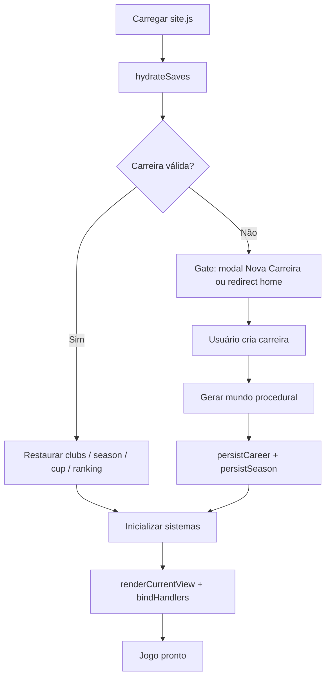
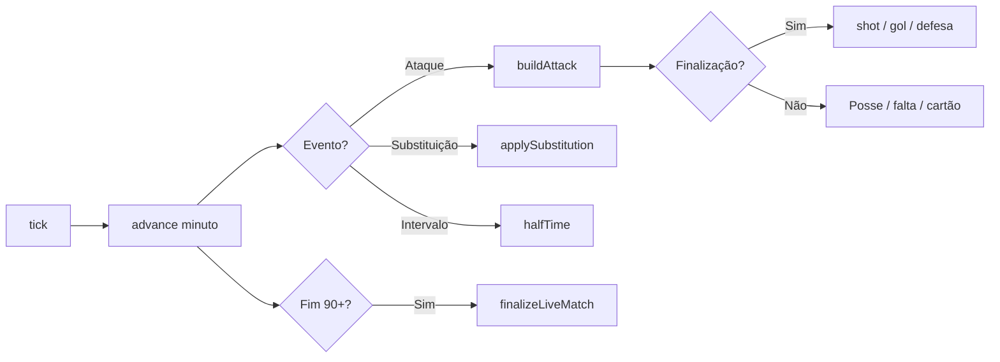
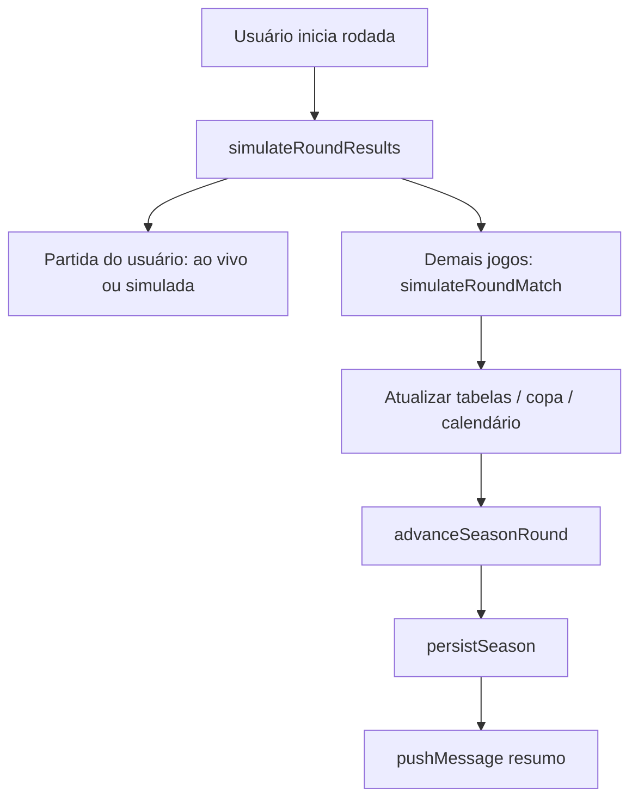
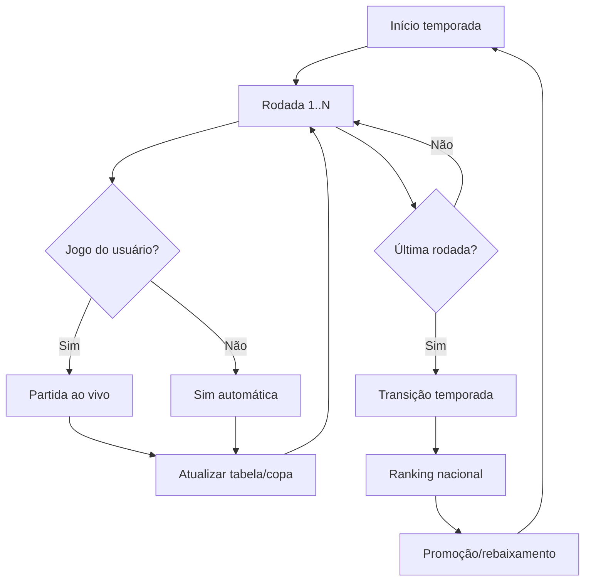
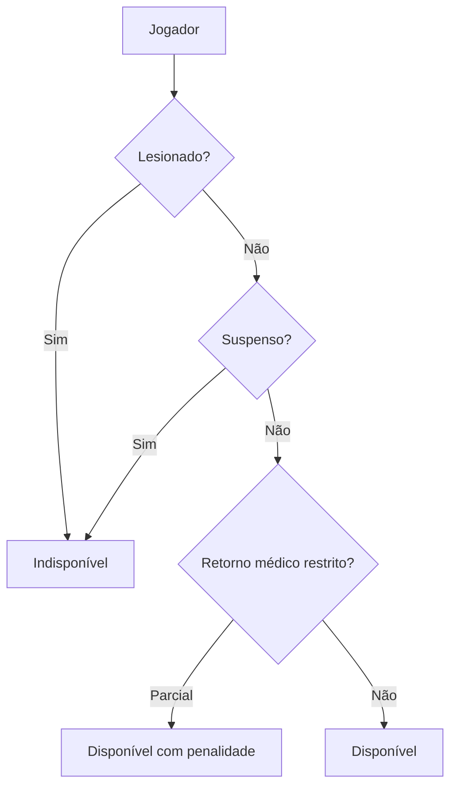

# Matchday Football — Documentação Técnica Completa

**Projeto:** Matchday Football Alpha 01  
**Tipo:** Simulador de gestão de futebol (browser, single-page)  
**Linguagem:** JavaScript vanilla (ES6+), HTML5, CSS3  
**Persistência:** `localStorage` (sem backend)  
**Última revisão:** Julho 2026

---

## Sumário

1. [Visão geral](#1-visão-geral)
2. [Arquitetura do sistema](#2-arquitetura-do-sistema)
3. [Boot e ciclo de vida](#3-boot-e-ciclo-de-vida)
4. [Motores de simulação](#4-motores-de-simulação)
5. [Motor de carreira e mundo](#5-motor-de-carreira-e-mundo)
6. [Motor de partida ao vivo](#6-motor-de-partida-ao-vivo)
7. [Motor de rodada e temporada](#7-motor-de-rodada-e-temporada)
8. [Calendário e treinos](#8-calendário-e-treinos)
9. [Campeonatos nacionais](#9-campeonatos-nacionais)
10. [Copa do Brasil](#10-copa-do-brasil)
11. [Ranking nacional](#11-ranking-nacional)
12. [Táticas e elenco](#12-táticas-e-elenco)
13. [Lesões, disciplina e médico](#13-lesões-disciplina-e-médico)
14. [Mensagens e notificações](#14-mensagens-e-notificações)
15. [Interface e handlers](#15-interface-e-handlers)
16. [Modelos de dados e persistência](#16-modelos-de-dados-e-persistência)
17. [Hospedagem e distribuição](#17-hospedagem-e-distribuição)
18. [Referência de constantes](#18-referência-de-constantes)
19. [Diagramas de fluxo](#19-diagramas-de-fluxo)
20. [Limitações conhecidas](#20-limitações-conhecidas)

---

## 1. Visão geral

O **Matchday Football Alpha 01** é um jogo de gestão de clube de futebol brasileiro executado inteiramente no navegador. O jogador cria uma carreira (técnico + clube), gerencia elenco, táticas, calendário, lesões e disputa campeonatos das Séries A, B, C e D, além da Copa do Brasil e ranking nacional.

### Características principais

- **Sem servidor de aplicação:** toda a lógica roda no cliente via `js/site.js`.
- **Save local:** progresso em `localStorage` com versionamento (`matchday-new-game` v4).
- **Partidas ao vivo:** simulação tick-a-tick com narração, substituições e eventos.
- **Partidas em background:** demais jogos da rodada simulados instantaneamente com a mesma engine.
- **Universo procedural:** clubes, jogadores e calendários gerados por seed RNG.

### Pontos de entrada

| Arquivo | Função |
|---------|--------|
| `home.html` | Landing — Novo Jogo / Continuar |
| `index.html` | Shell do jogo (7 views + modal de partida) |
| `INICIAR-JOGO.bat` | Sobe servidor HTTP Python na porta 5080 |

### Stack tecnológica

```
HTML5 (views estáticas)
  └── index.html / home.html
CSS (estático + injetado em runtime)
  └── css/*.css + optionsCss / modais em site.js
JavaScript (monolito IIFE)
  └── js/site.js — motor + UI + persistência
  └── js/home.js — landing
```

---

## 2. Arquitetura do sistema

### 2.1 Estrutura de diretórios

```
Matchday Football Alpha01/
├── home.html              # Página inicial
├── index.html             # Jogo principal
├── INICIAR-JOGO.bat       # Servidor local
├── INICIAR-LINK-EXTERNO.bat
├── LEIA-ME.txt
├── css/
│   ├── home.css
│   ├── site.css
│   ├── layout.css
│   ├── championship.css
│   └── calendar.css
├── js/
│   ├── home.js            # Lógica da landing
│   └── site.js            # Motor completo (~2421 linhas)
├── scripts/
│   └── start-tunnel.ps1   # Túnel Cloudflare
└── docs/                  # Esta documentação
```

### 2.2 Camadas lógicas em `site.js`

O arquivo `site.js` é uma **IIFE** (Immediately Invoked Function Expression) que encapsula todo o estado e comportamento:

| Camada | Responsabilidade |
|--------|------------------|
| **Constantes e catálogos** | Formações, lesões, divisões, fases da copa, tuning da engine |
| **RNG e geração** | `gameRandom()`, `generatedPlayer`, `createClub`, fixtures |
| **Motores** | Partida, rodada, temporada, ranking, copa |
| **Estado mutável** | `clubs`, `career`, `season`, `messages`, `calendarGames` |
| **Persistência** | `hydrateSaves`, `persistCareer`, `persistSeason` |
| **Renderização** | Funções `render*` por view |
| **Eventos** | `on()`, `onClick()`, `bindLiveActions()`, handlers de modal |

Não há framework (React/Vue); o DOM é manipulado diretamente com `innerHTML`, `querySelector` e listeners.

### 2.3 Views do jogo (`index.html`)

| ID | Nome | Conteúdo |
|----|------|----------|
| `dashboard` | Painel | Resumo, próximo jogo, ações rápidas |
| `squad` | Elenco | Lista de jogadores, status, lesões |
| `tactics` | Táticas | Formação, sliders, campo drag-drop |
| `table` | Tabela | Classificação da divisão do usuário |
| `ranking` | Ranking | Ranking nacional de clubes |
| `messages` | Mensagens | Feed de eventos (máx. 200) |
| `calendar` | Calendário | Agenda de jogos e treinos |

Modais são **injetados em runtime** via strings HTML/CSS em `site.js` (opções, nova carreira, tratamento, scout, campeonato, resultados da rodada, transição de temporada, etc.).

---

## 3. Boot e ciclo de vida

### 3.1 Sequência de inicialização



### 3.2 Gate de carreira

- URL `index.html?novo=1` abre modal **Criar Carreira**.
- Sem save em `matchday-new-game`, o jogo exige criação ou retorno a `home.html`.
- Após salvar: `redirectGame()` limpa query params (evita reabrir modal no reload).

### 3.3 Helpers de evento (padronização)

```javascript
const on = (el, type, handler) => el && el.addEventListener(type, handler);
const onClick = (el, handler) => on(el, 'click', handler);
const redirectGame = () => location.replace(location.pathname);
```

`bindLiveActions()` usa `.onclick` porque botões da partida ao vivo são recriados via `innerHTML` a cada tick.

---

## 4. Motores de simulação

### 4.1 Visão geral dos motores

| Motor | Funções-chave | Modo |
|-------|---------------|------|
| Partida ao vivo | `tick`, `advance`, `buildAttack`, `shot` | UI + timer |
| Partida AI | `simulateRoundMatch` | Instantâneo |
| Rodada | `simulateRoundResults`, `advanceSeasonRound` | Batch |
| Temporada | `prepareSeasonTransition`, `finalizeNationalRankingSeason` | Fim de ano |
| Calendário | `calendarGames`, `fixtureDetails`, `trainingRules` | Agenda |
| Copa | `cupCompetition`, `simulateCupFixtures` | Fases eliminatórias |
| Ranking | `nationalRankingEntries` | Pontuação anual |

### 4.2 RNG determinístico

- `gameRandom(seed)` — gerador com seed da carreira.
- Garante **reprodutibilidade** ao recarregar o mesmo save.
- Usado em: geração de jogadores, sorteios da copa, eventos de partida.

### 4.3 `engineTuning` — parâmetros centrais

| Parâmetro | Valor | Efeito |
|-----------|-------|--------|
| `foulRiskBase` | 0.54 | Base de risco de falta |
| `creationBase` | 0.47 | Criação de jogadas |
| `actionRateBase` | 0.60 | Ritmo de ações por minuto |
| `bookingBase` | 0.055 | Cartões |
| `blowoutGapStart` | 6 | Damping quando placar abre ≥6 gols |
| `subWindows` | [58, 70, 80] | Janelas de substituição |
| `subChaseWindows` | [72, 78] | Subs ofensivas quando perdendo |

Funções derivadas: `engineFoulRisk`, `engineProgressiveFoulRisk`, `engineBlowoutDamp`, `matchDifficultyForClub`.

### 4.4 Ritmo da partida (`gamePaceConfig`)

Persistido em `localStorage` chave `futmanager-pace`:

| Modo | Intervalo tick | Uso |
|------|----------------|-----|
| `fast` | Menor | Simulação rápida |
| `standard` | Médio | Padrão |
| `detailed` | Maior | Mais eventos visíveis |

---

## 5. Motor de carreira e mundo

### 5.1 Criação de carreira

1. Usuário define: nome do técnico, clube, divisão inicial, formação.
2. `createClub()` gera elenco com `generatedPlayer()` por posição.
3. `generatedOverall(role, attrs)` calcula overall ponderado por posição.
4. Universo: todos os clubes das 4 divisões + calendários + copa.

### 5.2 Regras por divisão (`divisionRules`)

| Divisão | Clubes | Power | Rodadas | Promoção | Rebaixamento |
|---------|--------|-------|---------|----------|--------------|
| A | 20 | 76–84 | 38 (turno/returno) | 0 | 4 |
| B | 20 | 70–78 | 38 + playoffs | 4 | 4 |
| C | 20 | 64–73 | 38 | 4 | 2 |
| D | 96 (16×6) | 56–68 | 10 + mata-mata | 6 | 0 |

### 5.3 Geração de elenco

- `generationFormationRoles` — 11 titulares por formação.
- `formationBenchExtras` — reservas específicas da formação.
- `generatedSquadRoles(formation)` — lista completa de posições a gerar.
- Especialistas (cobranças): `specialistChance` varia por divisão.

### 5.4 Atributos de jogador

Atributos técnicos incluem: `finishing`, `passing`, `dribble`, `speed`, `marking`, `tackling`, `heading`, `positioning`, `reflexes`, `penaltySaving`, `overallBase`, etc.

Overall final é **média ponderada** diferente para cada posição (GOL, ZAG, LAT, VOL, MC, MEI, PE, PD, ATA).

---

## 6. Motor de partida ao vivo

### 6.1 Loop principal



### 6.2 `buildAttack`

- Seleciona jogador atacante com base em formação, posição e tática.
- Considera: pressão rival, disciplina, fadiga (`workload`), lesão parcial.
- Pode resultar em: progressão, falta, perda de bola, chance de finalização.

### 6.3 `shot`

- Compara atacante (finishing, heading) vs goleiro (reflexes, positioning).
- Modificadores: casa/fora, dificuldade (`matchDifficultyForClub`), blowout damping.
- Gols atualizam placar, estatísticas e podem disparar mensagens.

### 6.4 Escalação simulada (`buildSimLineup`)

Usada em partidas AI e pré-live:

- Filtra `playerUnavailable` (lesão, suspensão, convocação).
- `starterScore` penaliza: bloqueio médico, carga alta, retorno restrito.
- Em jogos "fáceis" (`matchDifficultyForClub >= 2.5`), poupa jogadores com carga.

### 6.5 Substituições automáticas

- Janelas fixas: minutos 58, 70, 80 (e 72/78 se perdendo).
- Respeitam limite de 5 substituições e jogadores disponíveis no banco.

---

## 7. Motor de rodada e temporada

### 7.1 Fluxo de rodada



### 7.2 `simulateRoundMatch`

- Mesma engine de eventos que o ao vivo, sem UI.
- Executa minuto a minuto em loop até 90+.
- Retorna placar, cartões, gols para alimentar tabela e mensagens.

### 7.3 Fim de temporada

1. `prepareSeasonTransition` — calcula promoções/rebaixamentos, campeões.
2. Modal de transição com resumo.
3. `#startNextSeason` — nova temporada, reset parcial, `redirectGame()`.
4. `finalizeNationalRankingSeason` — pontos anuais do ranking nacional.

### 7.4 Persistência de temporada

`persistSeason()` grava em `matchday-season`:

- Rodada atual, tabelas, jogos disputados.
- Estado da copa (`cupCompetition`).
- Ranking nacional parcial.

---

## 8. Calendário e treinos

### 8.1 `calendarGames` (Map)

- Chave: timestamp normalizado do dia.
- Valor: lista de eventos (liga, copa, treino).
- `fixtureDetails` enriquece com adversário, mando, competição.

### 8.2 Intervalos de calendário por divisão

`leagueCalendarRange` define início/fim da temporada de liga:

| Divisão | Início (mês/dia) | Fim |
|---------|------------------|-----|
| A | 0/28 (jan) | 11/2 (dez) |
| B | 2/21 (mar) | 10/28 (nov) |
| C | 3/5 (abr) | 9/25 (out) |
| D | 3/5 (abr) | 8/13 (ago) |

`fixtureDateFor(division, round)` interpola datas entre início e fim.

### 8.3 Treinos (`trainingRules`)

Persistido em `matchday-training-rules`:

| Slot | Descrição |
|------|-----------|
| `before` | Treino pré-jogo |
| `after` | Treino pós-jogo |
| `free` | Dias livres |

Regras afetam carga (`workload`), recuperação e risco de lesão.

### 8.4 Regra de espaçamento Copa

Mínimo de **3 datas** entre jogos do mesmo clube (dois dias completos de descanso). O agendador da copa verifica conflitos com liga e fases anteriores.

---

## 9. Campeonatos nacionais

### 9.1 `nationalCompetitions`

Objeto por divisão (`A`, `B`, `C`, `D`) contendo:

- `teams` — lista ordenada de clubes.
- `fixtures` — jogos gerados (turno/returno ou grupos).
- `table` — pontos, vitórias, saldo, etc.

### 9.2 Série D — formato especial

- 96 clubes em 16 grupos de 6.
- 10 rodadas na fase de grupos.
- 4 melhores por grupo avançam.
- Mata-mata e playoffs em ida e volta.
- 6 promoções à Série C.

### 9.3 Série B — playoffs

- 1º e 2º sobem direto.
- 3º a 6º disputam playoffs (lógica em `advanceSeasonRound` / transição).

---

## 10. Copa do Brasil

### 10.1 Fases (`cupPhaseDefinitions`)

| Fase | Nome | Times | Ida/volta |
|------|------|-------|-----------|
| 1 | 1ª FASE | 28 | Não |
| 2 | 2ª FASE | 88 | Não |
| 3 | 3ª FASE | 48 | Não |
| 4 | 4ª FASE | 24 | Não |
| 5 | 5ª FASE | 32 | Sim |
| 6 | OITAVAS | 16 | Sim |
| 7 | QUARTAS | 8 | Sim |
| 8 | SEMIFINAL | 4 | Sim |
| 9 | FINAL | 2 | Não |

### 10.2 Entradas por critério (2026)

- **Série A:** entra apenas na 5ª fase (20 clubes).
- **4 especiais:** não Série A, maiores powers.
- **102 vagas estaduais:** demais clubes fora da Série A.
- **28 melhores ranqueados:** 1ª fase.
- **74 restantes:** 2ª fase direta.

### 10.3 Estado `cupCompetition`

```javascript
{
  currentPhase: number,
  champion: string | null,
  stages: [{ name, fixtures: [...] }]
}
```

Cada fixture: mandante, visitante, placar, data, `gameNumber`, `twoLegged`, agregado.

---

## 11. Ranking nacional

- `nationalRankingEntries` — array de clubes com pontos acumulados.
- Pontuação baseada em desempenho em competições oficiais ao longo da temporada.
- `finalizeNationalRankingSeason` consolida ao encerrar o ano.
- View `ranking` exibe tabela ordenada com tendência.

---

## 12. Táticas e elenco

### 12.1 Formações disponíveis

`4-3-3`, `4-4-2`, `3-5-2`, `4-2-3-1`, `4-1-4-1`, `5-3-2`, `4-3-1-2`, `3-4-3`

### 12.2 Sliders táticos (`tacticalValues`)

| Slider | Efeito na engine |
|--------|------------------|
| Pressão (`press`) | Mais faltas e recuperações |
| Ritmo (`tempo`) | Velocidade de `actionRate` |
| Largura (`width`) | Ataques pelas pontas |
| Profundidade (`depth`) | Bolas longas / defesa alta |
| Disciplina | Menos faltas táticas |
| Ofensividade | Mais chutes e risco |

### 12.3 Campo tático

- Drag-and-drop de jogadores no pitch SVG/HTML.
- `applyFormationChoice()` ao trocar formação.
- Titulares e reservas sincronizados com `club.roster`.

### 12.4 Carga de trabalho (`workload`)

| Nível | Risco lesão |
|-------|-------------|
| Baixa | 1.0× |
| Média | ~1.1× |
| Alta | ~1.25×+ |

`preventionProgram` do clube reduz risco (`preventionWorkloadEase`).

---

## 13. Lesões, disciplina e médico

### 13.1 Catálogo de lesões (`injuryCatalog`)

Lesões com: nome, duração em dias, gravidade, parte do corpo.

### 13.2 Resolução (`resolvePhysicalIncident`)

- Disparada em treinos e partidas.
- Considera: carga, prevenção, idade, histórico.
- Gera mensagem categoria `medical`.

### 13.3 Programas do clube

- **Prevenção** — reduz risco de lesão muscular.
- **Tratamento** — acelera recuperação (modal tratamento).
- **Retorno restrito** — jogador volta com penalidade em `starterScore`.

### 13.4 Disciplina

- Cartões amarelos acumulam suspensão.
- Vermelho direto — suspensão imediata.
- `playerUnavailable` verifica suspensões ativas.

---

## 14. Mensagens e notificações

### 14.1 `pushMessage`

```javascript
pushMessage({
  category: 'match' | 'medical' | 'discipline' | 'transfer' | 'system' | ...,
  title: string,
  body: string,
  date: Date
})
```

- Limite: **200 mensagens** (FIFO ao exceder).
- View `messages` lista com filtro por categoria.
- Dashboard mostra últimas mensagens relevantes.

---

## 15. Interface e handlers

### 15.1 Navegação principal

Botões `.nav-btn` com `data-view` alternam `renderCurrentView()`.

### 15.2 Modais principais

| Modal | Trigger | Ação |
|-------|---------|------|
| Nova carreira | `?novo=1` / sem save | Cria mundo |
| Opções | Menu opções | Ritmo, exportar save |
| Tratamento | Elenco / médico | Aplicar programa |
| Scout | Dashboard | Observar jogadores |
| Campeonato | Tabela | Detalhes da competição |
| Resultados rodada | Pós-rodada | Placares agregados |
| Transição temporada | Fim de ano | Próxima temporada |

### 15.3 Partida ao vivo

- Modal fullscreen com placar, minuto, narração, stats.
- Botões: velocidade, pular, substituições manuais (se habilitado).
- `bindLiveActions()` reanexa handlers após cada atualização de DOM.

### 15.4 Padrão de handlers (correção 2026-07-15)

- Preferir `on()` / `onClick()` para elementos estáveis.
- `event.target.closest('button')` em grids de formação.
- `redirectGame()` em vez de `location.reload()` para evitar query params.
- Cache bust: `site.js?v=20260715-handlers`.

---

## 16. Modelos de dados e persistência

### 16.1 Chaves localStorage

| Chave | Versão | Conteúdo |
|-------|--------|----------|
| `matchday-new-game` | v4 | Carreira, técnico, clubes, elencos, mensagens |
| `matchday-season` | — | Rodada, tabelas, copa, ranking parcial |
| `matchday-training-rules` | — | Configuração de treinos |
| `futmanager-pace` | — | Ritmo da partida |
| `matchday-live-match` | legado | Removido ao criar nova carreira |

### 16.2 Estrutura `matchday-new-game` (resumo)

```javascript
{
  version: 4,
  seed: number,
  careerSeason: number,        // ano base (ex: 2026)
  userClub: string,            // nome do clube
  userDivision: 'A'|'B'|'C'|'D',
  managerName: string,
  clubs: { [name]: Club },
  messages: Message[],
  nationalRanking: Entry[],
  createdAt: ISO string
}
```

### 16.3 Objeto `Club` (resumo)

```javascript
{
  name, division, power, formation,
  roster: Player[],
  tableStats: { points, played, won, drawn, lost, gf, ga },
  position: number,
  preventionProgram: 0-3,
  treatmentProgram: 0-3,
  // ...
}
```

### 16.4 Objeto `Player` (resumo)

```javascript
{
  name, role, age, overall,
  finishing, passing, dribble, speed, marking, tackling, heading,
  positioning, reflexes, penaltySaving,
  workload: 'low'|'medium'|'high',
  injury: { type, daysLeft } | null,
  suspension: { gamesLeft } | null,
  starter: boolean,
  // ...
}
```

### 16.5 Hidratação e validação

- `hydrateSaves()` — lê e valida JSON ao boot.
- Saves inválidos ou version mismatch → tratados como sem carreira.
- Datas serializadas como ISO strings e reidratadas com `new Date()`.

---

## 17. Hospedagem e distribuição

### 17.1 Servidor local

`INICIAR-JOGO.bat` executa:

```bat
python -m http.server 5080
```

URLs:

- http://127.0.0.1:5080/home.html
- http://127.0.0.1:5080/index.html

### 17.2 Acesso na rede local

Substitua `127.0.0.1` pelo IP da máquina (ex: `192.168.x.x:5080`).

### 17.3 Link externo

`INICIAR-LINK-EXTERNO.bat` + `scripts/start-tunnel.ps1` — túnel Cloudflare para compartilhar temporariamente.

### 17.4 Requisitos

- Python 3.x instalado e no PATH.
- Navegador moderno (Chrome, Firefox, Edge).
- JavaScript habilitado; cookies/localStorage liberados.

### 17.5 Exportação do jogo

Copie a pasta inteira do projeto. Não há build step. Opcional: exportar save via modal de opções (se implementado) ou backup manual das chaves `localStorage`.

---

## 18. Referência de constantes

### 18.1 Formações para clubes AI

`formationsForClubs`: `['4-3-3','4-4-2','3-5-2','4-2-3-1','4-1-4-1','5-3-2','4-3-1-2','3-4-3']`

### 18.2 Funções utilitárias

| Função | Descrição |
|--------|-----------|
| `clamp(v, min, max)` | Limita valor |
| `rnd(min, max)` | Random float |
| `int(min, max)` | Random inteiro |
| `pick(array)` | Elemento aleatório |
| `shuffle(array)` | Fisher-Yates |

### 18.3 Labels de UI

Textos em português brasileiro; datas com `toLocaleDateString('pt-BR')`.

---

## 19. Diagramas de fluxo

### 19.1 Ciclo completo de uma temporada



### 19.2 Decisão de disponibilidade do jogador



---

## 20. Limitações conhecidas

| Item | Descrição |
|------|-----------|
| Monolito | Toda lógica em um único `site.js` — manutenção complexa |
| Sem backend | Saves apenas localmente; sem sync entre dispositivos |
| Sem PWA | Requer servidor HTTP ou file:// limitado |
| Balanceamento | Tuning sujeito a ajustes em `engineTuning` |
| Alpha | Funcionalidades de transferência/scout podem ser parciais |

---

## Apêndice A — Checklist de teste

- [ ] Criar nova carreira em cada divisão (A/B/C/D)
- [ ] Jogar partida ao vivo até o fim
- [ ] Simular rodada completa
- [ ] Verificar promoção/rebaixamento
- [ ] Disputar fase da Copa
- [ ] Gerar lesão e recuperar via médico
- [ ] Alterar formação e sliders táticos
- [ ] Recarregar página — save persiste
- [ ] `?novo=1` não reabre modal após salvar

---

## Apêndice B — Glossário

| Termo | Significado |
|-------|-------------|
| Rodada | Rodada do campeonato nacional |
| Tick | Intervalo de simulação ao vivo (1 minuto de jogo) |
| Power | Força base do clube (afeta AI e dificuldade) |
| Workload | Carga física acumulada do jogador |
| Blowout damping | Redução de intensidade em goleadas |
| Gate | Bloqueio de boot até criar/restaurar carreira |

---

*Documento gerado para exportação — Matchday Football Alpha 01*
